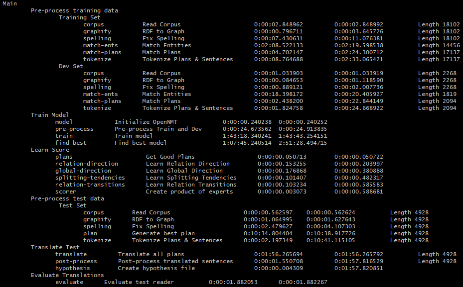

# Chimera


## Environment
We recommend installing all dependencies in a separate Conda environment.

### GPU-support
This code will run with or without a CUDA, but we recommend using a machine with CUDA.

### Dependencies
Execute `setup.sh`. This will install pip dependencies, as well as OpenNMT.

### Demo
To run the demo, execute `server/server.py`, preferably on a machine with a GPU. Running it for the first time will process the data and train the models, then expose a server for you to play with.


## Process
For training, the main pipeline consists of these sub-pipelines:
1. Preprocess Training (both train and dev sets)
    1. Load the data-set
    1. Convert RDFs to graphs
    1. Fix misspellings
    1. Locate entities in the text
    1. Match plans for each graph and reference
    1. Tokenize the plans and reference sentences   
1. Train Model
    1. Initialize model
    1. Pre-process training data
    1. Train Model
    1. Find best checkpoint, chart all checkpoints
1. Learn Score
    1. Get good plans from training set
    1. Learn Relation-Direction Expert
    1. Learn Global-Direction Expert
    1. Learn Splitting-Tendencies Expert
    1. Learn Relation-Transitions Expert
    1. Create Product of Experts
1. Preprocess Test Set
    1. Load the data-set
    1. Convert RDFs to graphs
    1. Fix misspellings
    1. Generate best plan
    1. Tokenize plans & sentences
1. Translate
    1. Translate test plans into text
    1. Post-process translated texts
    1. Save Translations to file (for human reference)
1. Evaluate model performance
    1. Evaluate test reader

Once running the main pipeline, every pipeline result is cached. 
If the cache is removed, the pipeline will continue from its last un-cached process.

**Note:** by default, all pipelines are muted, meaning any screen output will not present on screen.


## Example
Let's define the planner to be:
```python
naive_planner = NaivePlanner(WeightedProductOfExperts([
    RelationDirectionExpert,
    GlobalDirectionExpert,
    SplittingTendenciesExpert,
    RelationTransitionsExpert
]))
```

### WebNLG
Setting the `config` parameter to be `Config(reader=WebNLGDataReader, planner=naive_planner)`.

Output running for the first time:


Output running for the second time: (runs for just a few seconds to load the caches)


The expected result (will show on screen) reported by `multi-bleu.perl` is around:
- BLEU [47.27, 79.6, 55.3, 39.4, 28.7] (40,000 steps)
- BLEU [46.87, 79.2, 54.8, 39.1, 28.4] (40,000 steps)
- BLEU [46.70, 79.3, 55.0, 38.9, 28.0] (40,000 steps)
- BLEU [45.49, 77.9, 53.7, 37.8, 27.1] (40,000 steps)

### [Delexicalized WebNLG](https://github.com/ThiagoCF05/webnlg)
This dataset does not use a heuristic for entity matches, instead it was constructed manually.
This means it is of higher quality and easier to find a correct plan-match in train time.

Setting the `config` parameter to be `Config(reader=DelexWebNLGDataReader, test_reader=WebNLGDataReader, planner=naive_planner)`.

The expected result is around:
- BLEU [45.26, 80.1, 54.8, 37.9, 26.6] (20,000 steps)
- BLEU [44.77, 79.9, 54.0, 37.1, 25.9] (20,000 steps)
- BLEU [45.71, 81.1, 55.0, 37.9, 26.3] (20,000 steps)
- BLEU [45.66, 80.2, 54.9, 37.8, 26.5] (20,000 steps)

We attribute the worse BLEU to the fact the delexicalizations also remove articles and other text around it, and without proper referring expressions generations while the texts should have better structure, they are worse in fluency.